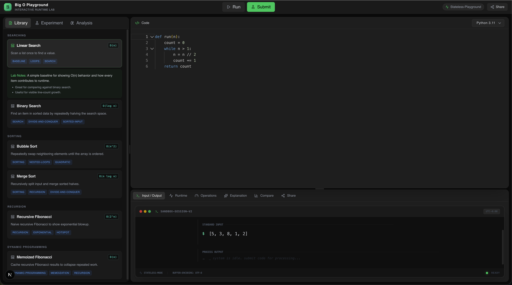

# Big O Lab


An interactive algorithm analysis playground that lets you write code, run empirical experiments across multiple input sizes, and visualize runtime complexity — all from the browser.

Big O Lab is an open-access workspace designed for learning and exploring algorithmic performance. Paste (or pick) an algorithm, configure input sizes and profiles, and watch the runtime curve emerge in real time. The backend instruments every execution, estimates time complexity, and can optionally call an LLM for natural-language explanations.

---

## Features

- **Monaco Code Editor** — Full-featured Python editor with syntax highlighting and line-level runtime heatmaps.
- **Preset Algorithm Library** — Built-in collection of classic algorithms (sorting, searching, recursion, DP) with curated starter code.
- **Empirical Experiments** — Run your code across configurable input sizes, input kinds (arrays, numbers), and profiles (random, sorted, reversed).
- **Complexity Estimation** — Automatic time-complexity classification derived from runtime data (curve fitting).
- **Line-Level Metrics** — Per-line execution counts and timing for identifying hotspots.
- **Runtime Visualizations** — Interactive charts (Recharts) showing execution time vs. input size growth curves.
- **Side-by-Side Comparison** — Compare two consecutive experiments to quantify improvements or regressions.
- **LLM Explanations** — Optional Ollama Cloud integration for AI-generated complexity breakdowns, with deterministic heuristic fallback.
- **Session Sharing** — Generate signed share tokens that capture your workspace, results, and analysis.
- **Rate Limiting & Runtime Controls** — IP-based rate limiting, request body size caps, and configurable execution timeouts.
- **Resizable Panel Layout** — LeetCode-style split-pane workspace built with `react-resizable-panels`.

---

## Architecture

```
┌────────────────────────────────────────────────────────────┐
│                    Frontend (Next.js)                     │
│  Monaco Editor · Recharts · Zustand · React Query         │
│  Port 3000                                                │
└─────────────────────────┬──────────────────────────────────┘
                          │ REST (JSON)
                          ▼
┌────────────────────────────────────────────────────────────┐
│                    Backend (FastAPI)                      │
│  Execution · Experiments · Complexity · Explanations      │
│  Shares · Presets · Runtime Controls                      │
│  Port 8000                                                │
├──────────────┬─────────────────┬────────────────┬─────────┤
│ PostgreSQL   │ Redis (opt.)    │ Ollama Cloud   │ Runner  │
│ SQLAlchemy   │ jobs/cache       │ explanations   │ local   │
│ + Alembic    │                  │                │ sandbox │
└──────────────┴─────────────────┴────────────────┴─────────┘
```

| Layer | Tech | Purpose |
|-------|------|---------|
| **Frontend** | Next.js 16, React 19, TypeScript | Playground UI, editor, charts |
| **State** | Zustand, TanStack React Query | Client state, server cache |
| **Editor** | Monaco Editor (`@monaco-editor/react`) | Code editing, line decorations |
| **Charts** | Recharts | Runtime growth curves, metrics |
| **Backend** | FastAPI, Pydantic v2, Uvicorn | API, execution, analysis |
| **Persistence** | PostgreSQL, SQLAlchemy, Alembic | Database and migrations |
| **Queue** | Dramatiq + Redis | Async job processing |
| **LLM** | Ollama Cloud (optional) | AI complexity explanations |

---

## Getting Started

### Prerequisites

- **Python 3.11+**
- **Node.js 20+** with **pnpm**
- **PostgreSQL 16+** for database-backed workflows and migrations
- **Redis** (optional — only needed for async job queues)

### Install Dependencies

```bash
make install
```

This runs `pip install -r requirements.txt` for the backend and `pnpm install` for the frontend.

### Start Development Servers

```bash
make dev
```

This starts both services concurrently:

| Service | URL | Description |
|---------|-----|-------------|
| Frontend | `http://localhost:3000` | Playground UI |
| Backend | `http://127.0.0.1:8000` | API server |
| API Docs | `http://127.0.0.1:8000/docs` | Swagger / OpenAPI |

The `make dev` command automatically configures the frontend to connect to the local backend:
```
NEXT_PUBLIC_PLAYGROUND_API_MODE=backend
NEXT_PUBLIC_API_BASE_URL=http://127.0.0.1:8000/api/v1
```

---

## Docker

Run the full stack in containers with a single command:

```bash
make docker-up
```

| Service | Port | Notes |
|---------|------|-------|
| Frontend | `3000` | Production Next.js build |
| Backend | `8000` | Uvicorn with local execution |
| PostgreSQL | `5432` | App database |
| Redis | `6379` | Job queue & caching |

The Docker stack runs frontend, backend, PostgreSQL, and Redis together. The frontend image is built to call the backend at `http://localhost:8000/api/v1`.

Other Docker commands:

```bash
make docker-build   # Build images without starting
make docker-down    # Stop and remove containers
```

---

## Configuration

### Frontend Environment

See [`frontend/.env.example`](frontend/.env.example) for all options.

| Variable | Values | Description |
|----------|--------|-------------|
| `NEXT_PUBLIC_PLAYGROUND_API_MODE` | `backend` · `mock` | `backend` calls the real API; `mock` uses local dummy data |
| `NEXT_PUBLIC_API_BASE_URL` | URL | Backend API base (e.g. `http://127.0.0.1:8000/api/v1`) |

### Backend Environment

See [`backend/.env.example`](backend/.env.example) for all options.

| Variable | Default | Description |
|----------|---------|-------------|
| `APP_ENV` | `development` | Environment name |
| `DEBUG` | `true` | Enable debug mode |
| `API_PREFIX` | `/api/v1` | API route prefix |
| `DB_HOST` | `127.0.0.1` | PostgreSQL host |
| `DB_PORT` | `5432` | PostgreSQL port |
| `DB_NAME` | `bigOlab` | PostgreSQL database name |
| `DB_USER` | from env | PostgreSQL username |
| `DB_PASSWORD` | from env | PostgreSQL password |
| `SECRET_KEY` | `change-this-in-production` | Signing key for share tokens |
| `EXECUTION_BACKEND` | `auto` | `auto` · `local` · `docker` |
| `EXECUTION_QUEUE_BACKEND` | `auto` | Async execution backend selection |
| `EXECUTION_DEFAULT_TIMEOUT_SECONDS` | `3` | Per-run timeout |
| `EXECUTION_MAX_TIMEOUT_SECONDS` | `5` | Hard timeout cap |
| `EXECUTION_MEMORY_LIMIT_MB` | `128` | Memory cap per execution |
| `REQUEST_MAX_BODY_BYTES` | `262144` | Maximum request size |
| `RATE_LIMIT_ENABLED` | `true` | Enable request throttling |
| `CACHE_ENABLED` | `true` | Enable response caching |
| `EXPLANATION_PROVIDER` | `heuristic` | `heuristic` · `ollama_cloud` |
| `EXPLANATION_ALLOW_FALLBACK` | `true` | Fall back to heuristic if LLM fails |
| `OLLAMA_API_KEY` | — | Ollama Cloud API key |
| `OLLAMA_MODEL` | `gpt-oss:120b` | Model identifier |
| `OLLAMA_API_BASE_URL` | `https://ollama.com/api` | Ollama endpoint |
| `REDIS_URL` | `redis://localhost:6379/0` | Redis connection string |
| `REDIS_REQUIRED` | `false` | Fail startup if Redis unavailable |
| `CORS_ALLOWED_ORIGINS` | `http://localhost:3000` | Allowed CORS origins |

---

## API Overview

All endpoints are prefixed with `/api/v1`. Interactive docs at `/docs`.

| Endpoint | Method | Description |
|----------|--------|-------------|
| `/health/live` | GET | Liveness probe |
| `/health/ready` | GET | Readiness probe with dependency status |
| `/playground/run` | POST | Execute code with optional instrumentation |
| `/playground/experiment` | POST | Run code across multiple input sizes |
| `/playground/status` | GET | Playground status and mode |
| `/presets` | GET | List all preset algorithms |
| `/presets/{slug}` | GET | Fetch a single preset |
| `/explanations/generate` | POST | Generate complexity explanation (LLM/heuristic) |
| `/comparisons/compare` | POST | Compare two experiment results |
| `/execution/status` | GET | Inspect execution backend availability |
| `/execution/run` | POST | Direct code execution |
| `/execution/jobs` | POST | Submit async execution job |
| `/execution/jobs/{job_id}` | GET | Fetch queued job status/result |
| `/shares` | POST | Create a shareable session token |
| `/shares/resolve` | POST | Resolve a share token |

---

## Preset Algorithm Library

The backend ships with a curated set of algorithms for immediate experimentation:

| Algorithm | Category | Complexity | Input Profile |
|-----------|----------|------------|---------------|
| Linear Search | Searching | O(n) | Random |
| Binary Search | Searching | O(log n) | Sorted |
| Bubble Sort | Sorting | O(n²) | Reversed |
| Merge Sort | Sorting | O(n log n) | Random |
| Recursive Fibonacci | Recursion | O(2ⁿ) | Random |
| Memoized Fibonacci | Dynamic Programming | O(n) | Random |

Each preset includes starter code, recommended input sizes, educational notes, and metadata tags.

---

## Makefile Commands

| Command | Description |
|---------|-------------|
| `make dev` | Start frontend + backend concurrently |
| `make install` | Install all dependencies |
| `make lint` | Lint both codebases |
| `make test` | Run all tests |
| `make build` | Production frontend build |
| `make migrate` | Create a new Alembic migration |
| `make migrate-up` | Apply pending migrations |
| `make migrate-down` | Roll back the latest migration |
| `make migrate-history` | Show migration history |
| `make docker-up` | Start full Docker stack |
| `make docker-down` | Stop Docker stack |
| `make clean` | Remove caches and build artifacts |

---

## Tech Stack

**Frontend**
- [Next.js 16](https://nextjs.org/) — App router, React Server Components
- [React 19](https://react.dev/) — UI library
- [TypeScript](https://www.typescriptlang.org/) — Type safety
- [Monaco Editor](https://microsoft.github.io/monaco-editor/) — Code editor
- [Recharts](https://recharts.org/) — Data visualization
- [Zustand](https://zustand-demo.pmnd.rs/) — State management
- [TanStack React Query](https://tanstack.com/query) — Server state & caching
- [Tailwind CSS 4](https://tailwindcss.com/) — Styling
- [Lucide React](https://lucide.dev/) — Icons

**Backend**
- [FastAPI](https://fastapi.tiangolo.com/) — Python web framework
- [Pydantic v2](https://docs.pydantic.dev/) — Data validation
- [Uvicorn](https://www.uvicorn.org/) — ASGI server
- [SQLAlchemy](https://www.sqlalchemy.org/) — ORM and database access
- [Alembic](https://alembic.sqlalchemy.org/) — Schema migrations
- [PostgreSQL](https://www.postgresql.org/) — Relational database
- [Dramatiq](https://dramatiq.io/) — Task queue
- [Redis](https://redis.io/) — Queue broker & cache
- [httpx](https://www.python-httpx.org/) — Async HTTP client (Ollama integration)

---

